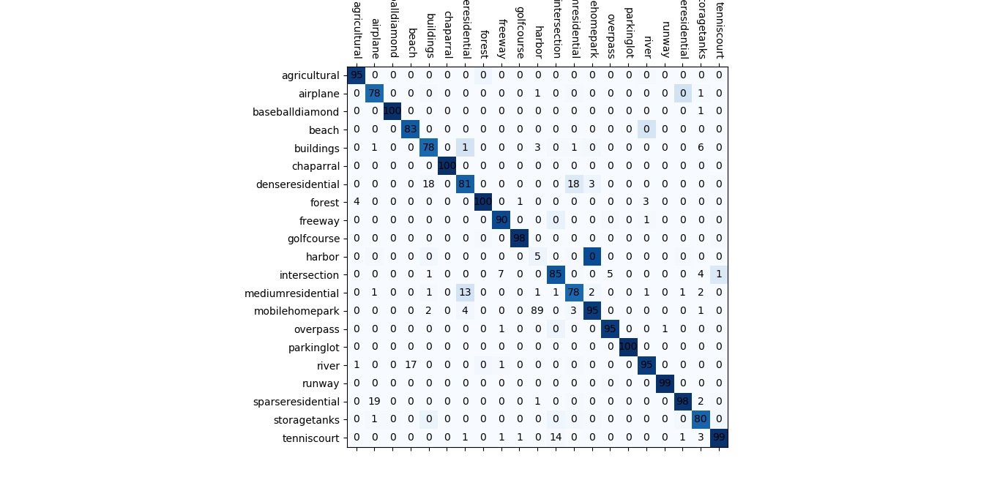
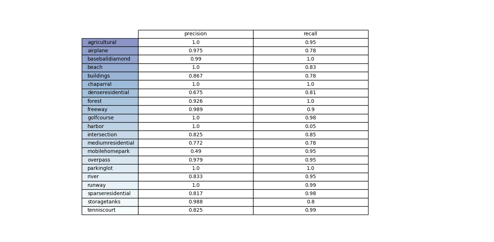

# Classification of Satellite images

## Classification of Satellite images :rocket: using VGG-Net and [UC Merced Land Use Dataset](http://weegee.vision.ucmerced.edu/datasets/landuse.html) for Training
## Results :
### After Training : 
Resultat of the Model After Training

Testing the classification of one batch of Pictures from [UC Merced Land Use Dataset](http://weegee.vision.ucmerced.edu/datasets/landuse.html) 


#### `Cost` and `Accuracy` : 
graph represent the values of both of `cost` and `accuracy` after training 


#### After Test: 
 Resultat after testing a Picture From different source [Google Map](maps.google.com)
 

- - - -
## How To use :

### Instalation :

* install [tensorflow 1.6](https://github.com/SakhriHoussem/How-to-install-tensorflow-gpu) [matplotlib](https://matplotlib.org/) [opencv](https://pypi.org/project/opencv-python/) [imutils](https://pypi.org/project/imutils)
```python
 pip install tensorflow matplotlib opencv-python imutils
 ```
### Train the Model:
To Train Model for different DataSets or Different Classification follow the steps : 

1. Choose your images DataSet for Training

2. from [dataSetGenerator](dataSetGenerator.py) use `dataSetToNPY()` to Convert Your DataSet to `file.npy` for Dataset Fast Reading   
 
 ```python
dataSetToNPY(path,SaveTo="DataSets",resize=True,resize_to=224,percentage=80,dataAugmentation= False) 
 ```
3. the Output of `dataSetToNPY()` :      
  - `dataSet_name_dataTrain.npy`     
  - `dataSet_name_labelsTrain.npy`     
  - `dataSet_name_dataTest.npy`      
  - `dataSet_name_labelsTest.npy`      
  - `dataSet_name_classes.npy`      
   
4. in [train_vgg19](train_vgg19.py) or [train_vgg16](train_vgg16.py)     
     
     - load images and Labels and Classes Name for training 
 ```python
batch = np.load("dataSet_name_dataTrain.npy")
labels = np.load("dataSet_name_labelsTrain.npy")
classes = np.load("dataSet_name_classes.npy") 
 ```

  - change `epochs` and `batch size` [optional] 
```python
batch_size = 10
epochs = 30
```
### For Distributed Tensorflow [optional] : 

1. Download and install [nmap](https://nmap.org/)
 
2. install [nmap](https://pypi.org/project/python-nmap/) python module
```
 pip install python-nmap
```
3. Set Workers and pss (parameter servers) devices name in [train_vgg19_distibuted](train_vgg19_distibuted.py)
 ```python
workers = ['PC1','PC2']
pss = ['PC3']
 ```
 
#### to Plot Graph of `cost` and `accuracy` :
 
from [dataSetGenerator](dataSetGenerator.py) use `plotFiles()`

```python
plotFiles(*path, xlabel='# epochs', ylabel='Error and Accu',autoClose = False)
```


### Test the Model :

from [test_vgg19](test_vgg19.py) or [test_vgg16](test_vgg16.py) :
#### read Image : 
to read One or Batch of pictures using 
```python
batch = imread(path) # read One or batch of pictures
```
get Classes name

 ```python
 classes = np.load("dataSet_name_classes.npy")  # get classes name for file.npy
 ```
or 
```python
classes = loadClasses("dataSet_name_classes.txt") # get classes name for file.txt
```
#### Show pictures : 
to Show one or batch of Pictures 
```python
picShow(data,labels,classes,just=None,predict=None,autoClose = False)
```


#### Draw Confusion Matrix : 
to Draw Confusion matrix use [confusion_matrix.py](confusion_matrix.py)



